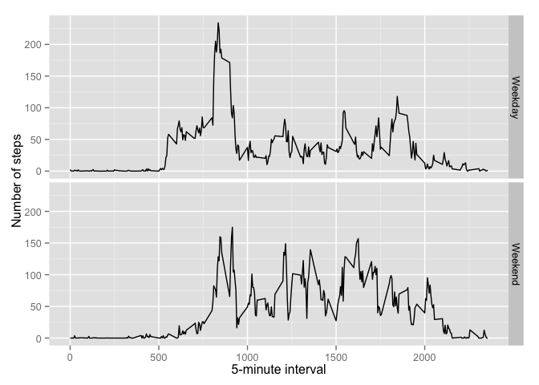

# Reproducible Research: Peer Assessment 1

Load up the supporting libraries to support the analysis.

```r
library(RCurl)
library(ggplot2)
library(dplyr)
```


## Loading and preprocessing the data
Load the data from the activity zip file and unzip the file to support reading into the data frame.


```r
unzip(zipfile="activity.zip")
activity_data <- read.csv("activity.csv")
```


## What is mean total number of steps taken per day?

***Analysis Note:*** Removed the NA values and ignoring the missing values for the analysis.

```r
steps_data <- aggregate(steps ~ date, data=activity_data, sum, na.rm = TRUE)
ggplot(steps_data, aes(x=steps)) +geom_histogram(col="blue", fill="blue") 
```

 

```r
mean_steps <- mean(steps_data$steps, na.rm=TRUE)
median_steps <- median(steps_data$steps, na.rm=TRUE)
```


|             | Mean  | Median |
|-------------|-------|--------|
| Daily Steps | 10,766 | 10,765 |


## What is the average daily activity pattern?

```r
dailyStepsByInterval <- activity_data %>% filter(!is.na(steps)) %>% group_by(interval) %>% summarize(steps = mean(steps))
ggplot(dailyStepsByInterval, aes(x=interval, y=steps)) + geom_line() + xlab("5 minute interval")+ylab("Average number of steps taken")
```

 

```r
maxSteps <- dailyStepsByInterval[which.max(dailyStepsByInterval$steps),]
```

On average across all the days in the dataset the 5-minute interval, the table below contains the maximum number of steps:

| Max Interval         | Max Number of steps |
|----------------------|---------------------|
|835 | 206.1698113  |


## Imputing missing values

Note that there are a number of days/intervals where there are missing values (coded as NA). The presence of missing days may introduce bias into some calculations or summaries of the data.

The following table contains a summary of rows with missing row values and those rows with values present (NOT NA) in the dataset (i.e. the total number of rows with NAs):

```r
missingStepValues <- is.na(activity_data$steps)
missingCounts <- table(missingStepValues)
```

|                     | Count |
|---------------------|-------|
| Missing values (NA) | 2304 |
| Values Present | 15264 |

Replace missing (NA) values with the 5-minute interval mean.


```r
fillMissingSteps <- function(steps, interval) {
  filledVal <- NA
  if (!is.na(steps))
    filledVal <- c(steps)
  else
    filledVal <- (dailyStepsByInterval[dailyStepsByInterval$interval == interval, "steps"])
  return(filledVal)
}

mutateActivityData <- activity_data
mutateActivityData$adjSteps <- mapply(fillMissingSteps, mutateActivityData$steps, mutateActivityData$interval)
mutateActivityData$StepDate <- as.Date(mutateActivityData$date)
adj_total_steps <- tapply(mutateActivityData$steps, mutateActivityData$date, FUN=sum)

qplot(adj_total_steps, binwidth=1000, xlab="Total number of steps taken each day (adj for missing values)")
```

 

```r
mean_steps <- mean(adj_total_steps, na.rm=T)
median_steps <- median(adj_total_steps, na.rm=T)
```

|             | Mean  | Median |
|-------------|-------|--------|
| Daily Steps | 10,766 | 10,765 |

NOTE: Inserting the mean interval value when a NA step value is encountered did not for this dataset impact the calculated means and median values.

## Are there differences in activity patterns between weekdays and weekends?

```r
mutateActivityData$dayType <- ifelse(grepl("S(at|un)", weekdays(mutateActivityData$StepDate)), "Weekend", "Weekday")

averages <- aggregate(steps ~ interval + dayType, data = mutateActivityData, mean)
ggplot(averages, aes(interval, steps)) + geom_line() + facet_grid(dayType ~ .) + 
    xlab("5-minute interval") + ylab("Number of steps")
```

 

Some findings from the analysis above include:

* Weekend step activity is more evenly spread than observed for the weekdays.
* Weekday activity appears concentrated more in the morning than later in the day.  
* Individuals start workouts later on the weekend vs the weekday.

